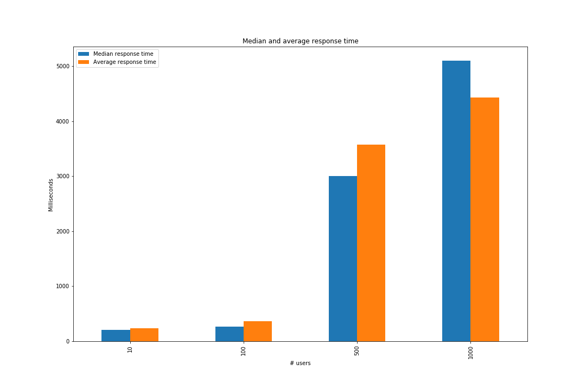
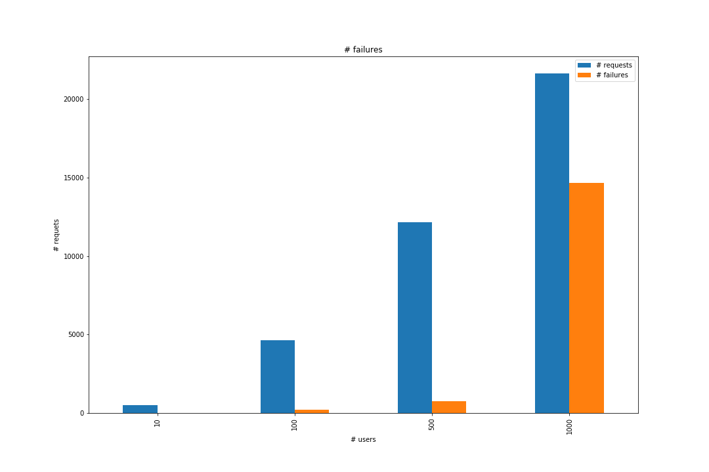

# Stress test of RasaBot

## Details of test

__Framework__: `Locust.io`

__Test parameters__:
* Number of users (clients)
    * *10*, _100_, _500_, _1000_
* Time between requests - _uniform random variable between 2 and 5 seconds_

Total number of tests - 4 (with different user number parameter)

## Graphics

### Median and average response time

### Number of failed requests

## Data

### 10 users

| Method | Name | # requests    | # failures | Median response time | Average response time | Min response time | Max response time | Average Content Size | Requests/s |      |
|--------|------|---------------|------------|----------------------|-----------------------|-------------------|-------------------|----------------------|------------|------|
| 0      | GET  | /api/messages | 241        | 7                    | 210                   | 242               | 17                | 1268                 | 2516       | 1.34 |
| 1      | POST | /api/messages | 247        | 9                    | 210                   | 240               | 12                | 1420                 | 43         | 1.38 |
| 2      | None | Total         | 488        | 16                   | 210                   | 241               | 12                | 1420                 | 1264       | 2.72 |

### 100 users

| Method | Name | # requests    | # failures | Median response time | Average response time | Min response time | Max response time | Average Content Size | Requests/s |       |
|--------|------|---------------|------------|----------------------|-----------------------|-------------------|-------------------|----------------------|------------|-------|
| 0      | GET  | /api/messages | 2296       | 103                  | 290                   | 392               | 10                | 2421                 | 2373       | 12.82 |
| 1      | POST | /api/messages | 2341       | 99                   | 250                   | 333               | 15                | 5275                 | 43         | 13.08 |
| 2      | None | Total         | 4637       | 202                  | 270                   | 362               | 10                | 5275                 | 1196       | 25.90 |

### 500 users

| Method | Name | # requests    | # failures | Median response time | Average response time | Min response time | Max response time | Average Content Size | Requests/s | Content |
|--------|------|---------------|------------|----------------------|-----------------------|-------------------|-------------------|----------------------|------------|---------|
| 0      | GET  | /api/messages | 5926       | 401                  | 4500                  | 4741              | 4                 | 14217                | 1206       | 33.11   |
| 1      | POST | /api/messages | 6244       | 370                  | 1100                  | 2473              | 7                 | 11589                | 42         | 34.89   |
| 2      | None | Total         | 12170      | 771                  | 3000                  | 3577              | 4                 | 14217                | 609        | 67.99   |

### 1000 users

| Method | Name | # requests    | # failures | Median response time | Average response time | Min response time | Max response time | Average Content Size | Requests/s | Content |
|--------|------|---------------|------------|----------------------|-----------------------|-------------------|-------------------|----------------------|------------|---------|
| 0      | GET  | /api/messages | 10481      | 7402                 | 5100                  | 4445              | 4                 | 21734                | 129        | 58.48   |
| 1      | POST | /api/messages | 11148      | 7277                 | 5100                  | 4421              | 3                 | 22005                | 15         | 62.20   |
| 2      | None | Total         | 21629      | 14679                | 5100                  | 4432              | 3                 | 22005                | 70         | 120.67  |
